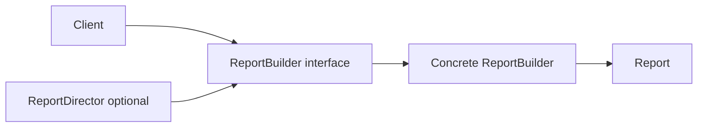

# Builder

*Constructing complex objects step by step instead of passing many constructor arguments at once.*

## What This Pattern Is For

### The Problem

When an object has many optional flags and configuration fields, constructor calls become hard to read and easy to break:

```php
$report = new Report(
    'Monthly',
    true,
    false,
    'pdf',
    'uk',
    ['sales', 'profit'],
    new DateTimeImmutable('2026-03-01'),
    new DateTimeImmutable('2026-03-31'),
    true
);
```

This leads to:
- **Low readability** - difficult to understand what each argument means
- **Error-prone calls** - easy to swap booleans or fields by mistake
- **Rigid construction** - adding new options forces constructor changes in many places

### What Builder Solves

Builder splits object creation into named steps. The client sets only needed options and calls `build()` at the end:

```php
$report = (new ReportBuilder())
    ->title('Monthly')
    ->format('pdf')
    ->locale('uk')
    ->includeCharts()
    ->period(new DateTimeImmutable('2026-03-01'), new DateTimeImmutable('2026-03-31'))
    ->build();
```

The flow becomes explicit, readable, and easier to validate.

### Summary

| Problem | What Builder Does |
|---------|-------------------|
| Long constructor with mixed arguments | Named step-by-step API |
| Hard to see intent | Fluent, self-documenting calls |
| Validation spread around callers | Centralized validation inside builder |
| Repeated setup logic | Reusable construction recipes via Director |

---

## Example: Report Builder

### Main participants

- **Product**: `Report` - final immutable-like object with report settings.
- **Builder interface**: `Interfaces/ReportBuilder.php` - defines building steps.
- **Concrete builder**: `ReportBuilder.php` - stores temporary state and creates `Report`.
- **Director**: `ReportDirector.php` - optional class with predefined build recipes.

### Flow diagram



Client usage:

```php
$builder = new ReportBuilder();
$report = $builder
    ->title('Monthly')
    ->format('pdf')
    ->locale('uk')
    ->includeCharts()
    ->period(new DateTimeImmutable('2026-03-01'), new DateTimeImmutable('2026-03-31'))
    ->build();
```

Director usage:

```php
$director = new ReportDirector(new ReportBuilder());
$report = $director->buildMonthlyPerformanceReport(
    new DateTimeImmutable('2026-03-01'),
    new DateTimeImmutable('2026-03-31')
);
```

### SOLID - D (Dependency Inversion Principle)

DIP states: *High-level modules should not depend on low-level modules. Both should depend on abstractions.*

In other words, high-level code should depend on abstractions, not on concrete implementations.

Here:

- **Director** - high-level module (defines the "recipe" for building).
- **ReportBuilder** (concrete class) - low-level module (actual implementation).
- **ReportBuilder** (interface) - abstraction.

Instead of Director depending on the concrete `ReportBuilder` class, it depends on the `ReportBuilder` interface. So when you add or change builder implementations (e.g. `CachedReportBuilder`, `ValidatedReportBuilder`), you do not need to change Director - it works with the abstraction.

---

## When to Use

- You have many optional parameters and configuration flags.
- Object creation has validation rules or dependencies between fields.
- You want readable object construction in business code.
- You need reusable presets (for example monthly report, raw export, executive summary report).

## Where It Is Commonly Used

- HTTP request builders (`method`, `headers`, `timeout`, `body`)
- Database query builders (`select`, `where`, `join`, `orderBy`)
- Configuration objects for SDKs and clients
- Test data builders for fixtures in unit tests
- Report/document generation pipelines

## Builder vs Factory Patterns

| Pattern | Main question it answers |
|---------|--------------------------|
| Simple Factory / Factory Method | **Which concrete object should be created?** |
| Abstract Factory | **Which family of related objects should be created?** |
| Builder | **How to assemble one complex object step by step?** |

Builder can be combined with Factory patterns: a factory can choose a builder, and the builder can assemble the final object.
