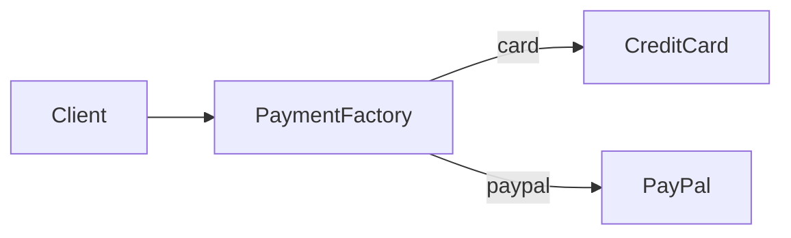
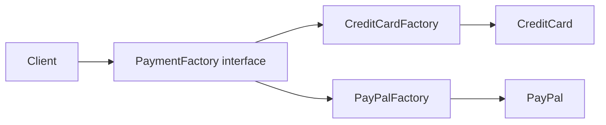
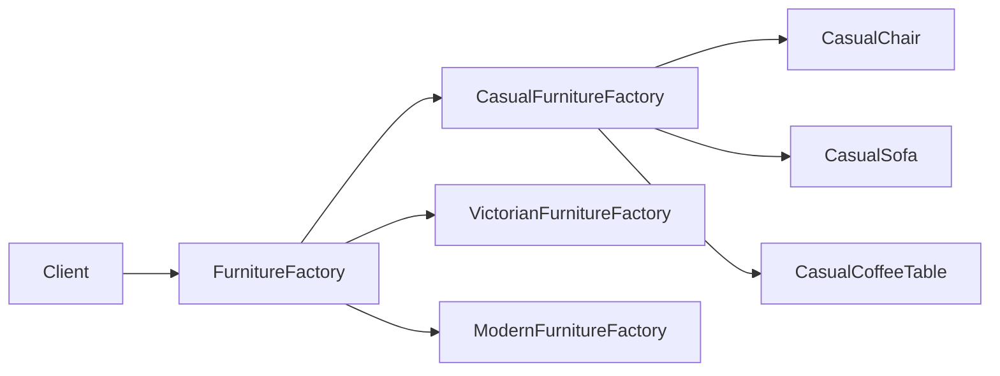

# Factory Patterns

Factory patterns solve one shared problem: creating objects without direct `new` usage in high-level domain code.

In this section:
- [SimpleFactory](./SimpleFactory/)
- [FactoryMethod](./FactoryMethod/)
- [AbstractFactory](./AbstractFactory/)

## Terms

- **High-level code** - business/orchestration code that describes what should happen, not how concrete classes are instantiated.  
  Examples: `CheckoutService`, `OrderService`, `RoomFurnisher`.
- **`new` in high-level code** - business logic directly creates concrete classes (`new CreditCard()`, `new PayPal()`), increasing coupling.
- **Composition Root** - the dependency wiring/bootstrap layer (container/provider/bootstrap), where `new` is expected and acceptable.
- **Product** - an object created by a factory.
- **Product family** - a set of related, compatible products (for example: Chair + Sofa + CoffeeTable in one style).

## Core Difference

|                     | Simple Factory | Factory Method | Abstract Factory |
|---------------------|----------------|----------------|------------------|
| What it creates     | 1 product (chosen by parameter) | 1 product (chosen by factory type) | a family of products |
| Where logic lives   | one central `switch/match` | in factory subclasses | in concrete family factory |
| Abstraction level   | lower          | medium         | higher           |
| Number of methods   | usually 1 `create(type)` | usually 1 `createX()` | multiple `createX()` methods |
| How it extends      | often by modifying factory | by adding a new factory class | by adding a new family factory |
| Repo example        | `PaymentFactory` | `CreditCardFactory` / `PayPalFactory` | `CasualFurnitureFactory` / `VictorianFurnitureFactory` / `ModernFurnitureFactory` |

## Detailed Comparison

| Criterion | Simple Factory | Factory Method | Abstract Factory |
|---|---|---|---|
| How client selects implementation | passes parameter (`'card'`, `'paypal'`) | uses selected factory object (`PayPalFactory`) | uses selected family factory (`ModernFurnitureFactory`) |
| What client depends on | one factory + product interface | factory interface + product interface | factory interface + multiple product interfaces |
| Open/Closed Principle | weaker (new type often means editing `match`) | stronger (new type means new factory class) | strong for adding new families |
| Main risk | can become a "god factory" | many small factory classes | adding a new product type impacts all families |

## How It Is Implemented In This Repository

### 1) Simple Factory

`PaymentFactory::create(string $type)` returns `PaymentMethod` via `match`.
- Best when you need centralized creation for one product type with parameter-based choice.
- See: [SimpleFactory](./SimpleFactory/)

### 2) Factory Method

`PaymentFactory` (interface) + `CreditCardFactory`, `PayPalFactory`.
- Best when new product types should be added via extension, not modification.
- See: [FactoryMethod](./FactoryMethod/)

### 3) Abstract Factory

`FurnitureFactory` creates `Chair`, `Sofa`, `CoffeeTable` as one consistent family.
- Best when multiple related objects must stay compatible.
- See: [AbstractFactory](./AbstractFactory/)

## When To Choose Which

- Choose **Simple Factory** when you need quick, centralized creation for one product category.
- Choose **Factory Method** when you expect frequent extensions with new product variants.
- Choose **Abstract Factory** when you need coordinated creation of related objects that must not be mixed.

## Diagrams

### Simple Factory

### Factory Method

### Abstract Factory

