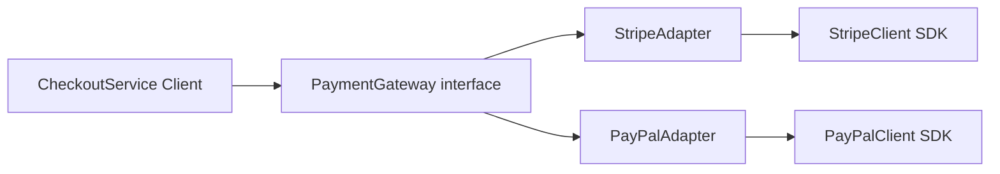

# Adapter (Wrapper)

*Converting incompatible interfaces so your application can work with third-party services through one stable contract.*

## What This Pattern Is For

### The Problem

Your checkout flow needs a single payment API, but providers expose different SDK methods and data formats:

- Stripe expects amount in cents and uses `createCharge(...)`.
- PayPal expects decimal strings and uses `capturePayment(...)`.

Without Adapter, provider-specific logic leaks into business code:
- `if/switch` by provider in `CheckoutService`
- duplicated format conversions
- hard-to-test integration details mixed with domain logic

### What Adapter Solves

Adapter introduces a project-level contract (`PaymentGateway`) and wraps each provider SDK:

- `StripeAdapter implements PaymentGateway`
- `PayPalAdapter implements PaymentGateway`

Business code depends only on `PaymentGateway`, while adapters translate request/response formats.

### Summary

| Problem | What Adapter Does |
|---------|-------------------|
| Different provider APIs | One common interface for the app |
| Scattered conversion logic | Centralized mapping in adapter classes |
| Tight coupling to SDK classes | Business code depends on abstraction |
| Hard to replace providers | Swap adapters without changing client code |

---

## Example: Payment Gateway Adapters

**1. Target interface** - what client code depends on:

```php
interface PaymentGateway
{
    public function charge(float $amount, string $currency, array $meta = []): PaymentResultDTO;
}
```

**2. Vendor APIs** - educational simulation of external SDKs:

In this example, `StripeClient` and `PayPalClient` are simplified classes that imitate third-party packages.

Assume:
- Stripe expects `createCharge(...)`, amount in **cents**, and lowercase currency.
- PayPal expects `capturePayment(...)`, amount as a **decimal string**, and uppercase currency.
- Our application expects one unified method: `charge(float $amount, string $currency, array $meta = []): PaymentResultDTO`.

Because these interfaces and data formats are different, we need adapters to translate between our app contract and each vendor SDK.

```php
class StripeClient
{
    public function createCharge(array $payload): array
    {
        return ['status' => 'succeeded', 'id' => 'stripe_tx_1'];
    }
}

class PayPalClient
{
    public function capturePayment(array $payload): array
    {
        return ['state' => 'approved', 'transaction_id' => 'paypal_tx_1'];
    }
}
```

**3. Adapters** - translate your contract to each vendor format:

```php
class StripeAdapter implements PaymentGateway
{
    public function charge(float $amount, string $currency, array $meta = []): PaymentResultDTO
    {
        $response = $this->stripeClient->createCharge([
            'amount' => (int) round($amount * 100),
            'currency' => strtolower($currency),
            'metadata' => $meta,
        ]);

        return new PaymentResultDTO(($response['status'] ?? '') === 'succeeded', $response['id'] ?? null);
    }
}

class PayPalAdapter implements PaymentGateway
{
    public function charge(float $amount, string $currency, array $meta = []): PaymentResultDTO
    {
        $response = $this->payPalClient->capturePayment([
            'total' => number_format($amount, 2, '.', ''),
            'currency_code' => strtoupper($currency),
            'custom' => $meta,
        ]);

        return new PaymentResultDTO(($response['state'] ?? '') === 'approved', $response['transaction_id'] ?? null);
    }
}
```

**4. Unified DTO** - one response shape for business code:

```php
class PaymentResultDTO
{
    public function __construct(
        private bool $success,
        private ?string $transactionId
    ) {}
}
```

**5. Client code** - no Stripe/PayPal logic inside:

```php
class CheckoutService
{
    public function __construct(private PaymentGateway $paymentGateway) {}

    public function checkout(float $amount, string $currency = 'USD'): PaymentResultDTO
    {
        return $this->paymentGateway->charge($amount, $currency);
    }
}
```

### Flow diagram



Client usage (provider chosen outside `CheckoutService`):

```php
$gateway = new StripeAdapter(new StripeClient());
$checkout = new CheckoutService($gateway);

$result = $checkout->checkout(150.00, 'USD');
if ($result->isSuccess()) {
    // order paid
}
```

Switch provider without touching `CheckoutService`:

```php
$gateway = new PayPalAdapter(new PayPalClient());
$checkout = new CheckoutService($gateway);
$result = $checkout->checkout(150.00, 'USD');
```

---

## When to Use

- You integrate one or more third-party services with incompatible APIs.
- You want your business logic to stay independent of vendor SDK details.
- You expect providers to change or multiple providers to coexist.

## Where It Is Commonly Used

- Payment gateways (Stripe/PayPal/LiqPay)
- Email providers (Mailgun/SendGrid/SES)
- Storage drivers (S3/GCS/local)
- Legacy SOAP services behind modern REST-style contracts

## Adapter vs Related Patterns

| Pattern | Main question it answers |
|---------|--------------------------|
| Adapter | **How can incompatible interfaces work together?** |
| Facade | **How to simplify a complex subsystem interface?** |
| Decorator | **How to add behavior without changing interface?** |

In this example, Adapter changes *interface shape* and *data mapping* between app contract and vendor SDK APIs.
